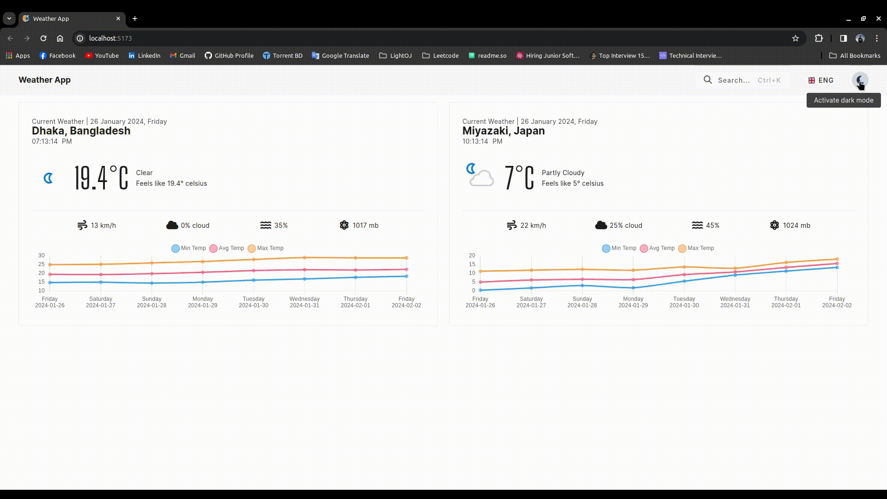
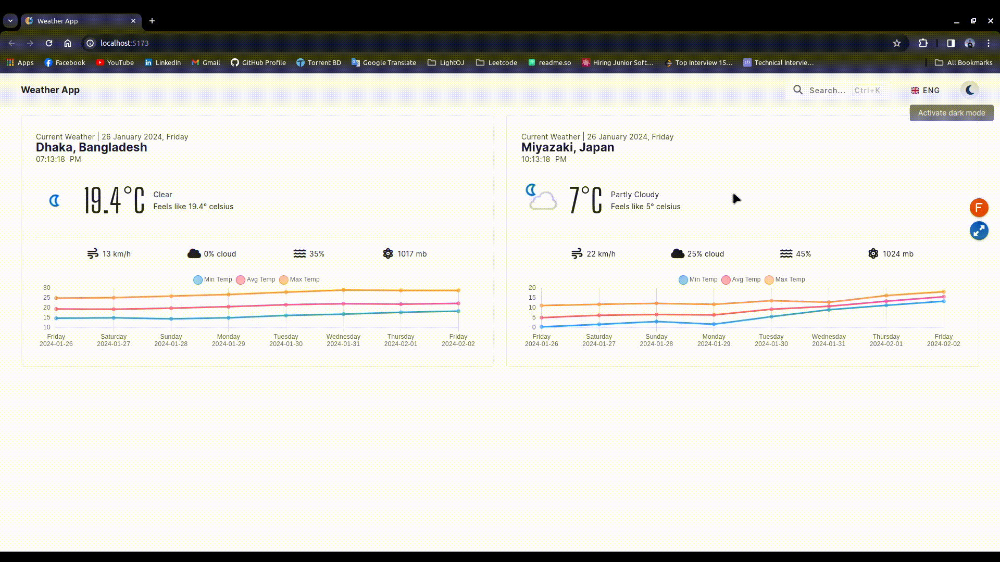
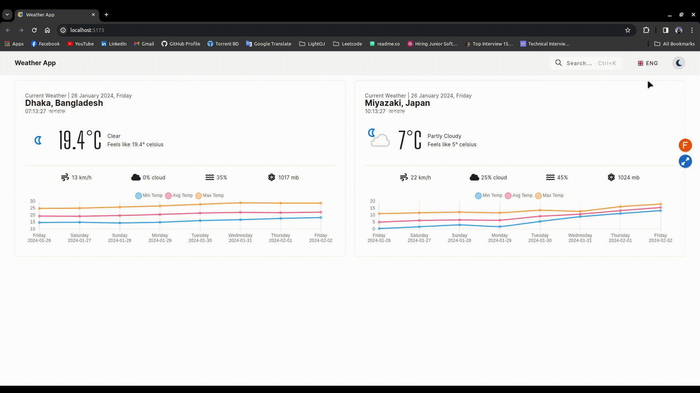
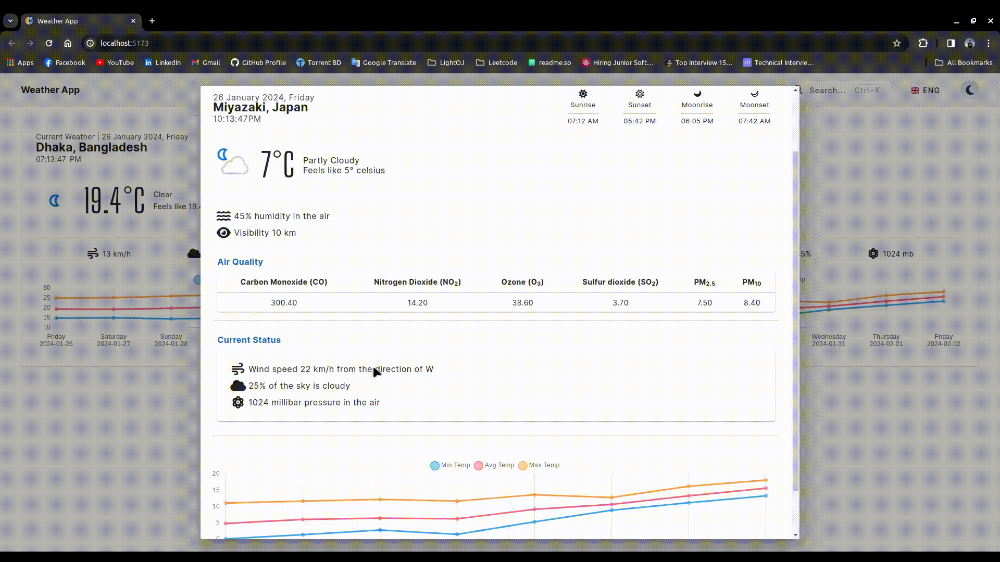
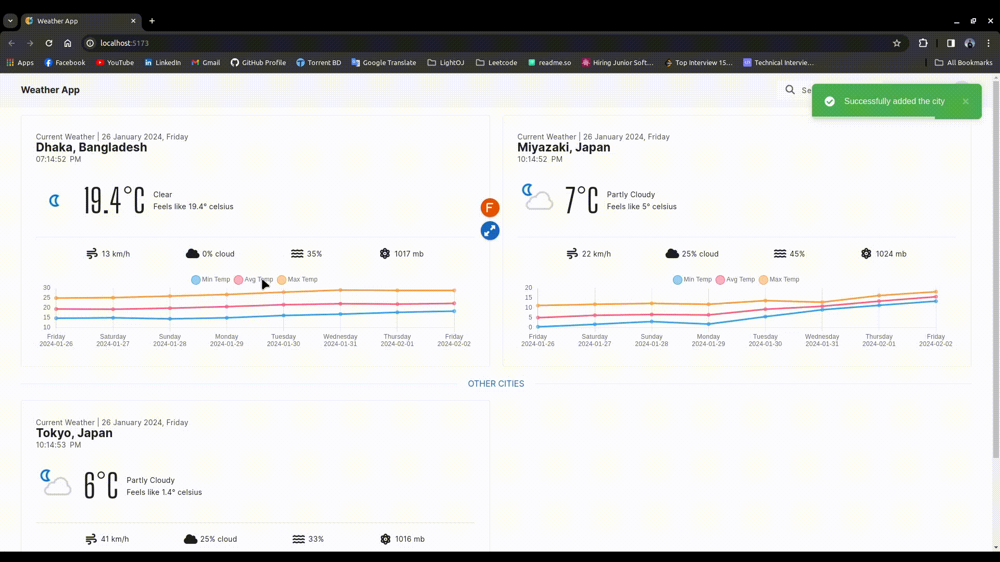

# Weather App

A web system that displays the weather information of Japan (Miyazaki) and Bangladesh (Dhaka) on the screen. User can add other cities as well. They can search any city's weather and pin those on the homepage.


## Tech Stack

**Client:** Vue, VeuX, Vuetify

**External API:** [Weather API](https://www.weatherapi.com)

**Testing:** Vitest

## Features

- Light/dark mode toggle
- Multiple language feature
- Keyboard interaction
- Data caching for optimal network call
- Data storing in local storage
- Live local clock
- Fetching weather information of any city
- Pinning favorite cities on the homepage

## Environment Variables

To run this project, you will need to add the following environment variables to your `.env` file.

- `VITE_API_KEY`: Get a API from [Weather API](https://www.weatherapi.com) and store that key in this variable.

## Run Locally

- Clone the project

```bash
git clone git@github.com:JanayAlam/weather-app.git weather-app
```

- Go to the project directory

```bash
cd weather-app
```

- Install dependencies

```bash
yarn install
```

- Configure the environmental variables

```bash
cp default.env .env
```

Then replace the `VITE_API_KEY`'s value `YOUR_WEATHER_API_KEY` with your [Weather API](https://www.weatherapi.com)'s API key.

- Start the server

```bash
yarn run dev
```

## Running Tests

To run tests, run the following command

```bash
yarn run test
```


## Demo

**Light and Dark theme:** Users can toggle between dark and light theme mode.



**Multiple language feature:** Users can switch to English, Bengali, and Japanese language.



**Weather information:** Users can see the weather information of any city both in Celsius and Fahrenheit scale in detail. There is a chart showing how can be the temperature in the next seven days.



**Weather forecasts:** Users can see the weather forecasts values in detail.



**Search cities:** Users can search any city to know its weather information.


**Keyboard interaction and pinning cities on the homepage:** Users can open the search bar by clicking `ctrl+k` and pin cities on the homepage from the details page.


**Remove pinned cities from the homepage:** Users can remove pinned cities from the homepage.


**Data storing:** All the information is stored in the local storage. So, hard refresh will not delete the states.


